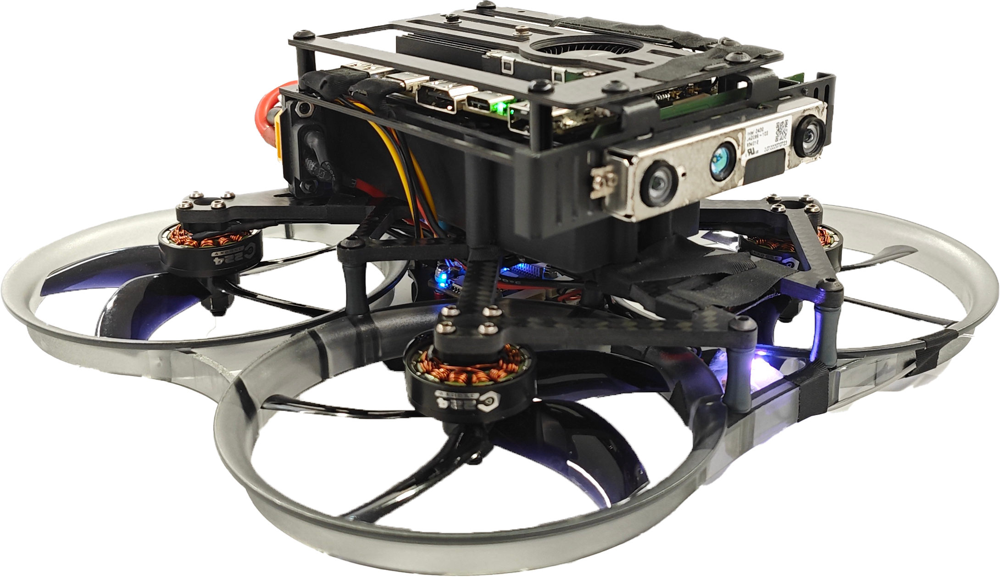

  <h1 align="center">⚡️<ins>EnNavi</ins> ⚡️ Embodied Navigation </h1>
  

  <!-- TODO(Derkai): 这里可以补齐主要贡献人员链接 -->
    <!-- <a href="https://贡献成员链接/">XXX XXX</a> -->
    <!-- · -->
    <!-- <a href="https://贡献成员链接/">XXX;XXX</a> -->
    <!-- · -->
    <!-- <a href="https://贡献成员链接/">XXX;XXX</a> -->
  

  <h2 align="center">
    <!-- 
ICCV 2023
 -->
    <a href="https://github.com/emNavi/X152b" align="center">Code</a> | 
    <a href="https://x152b.readthedocs.io/en/latest/introduction/index.html" align="center">Docs</a> | 
    <a href="https://x152b.readthedocs.io/en/latest/code_lib/index.html" align="center">Flying your own!</a>
  </h2>
  

     -->
     
    <em>Embodied Navigation(emNavi)是一项基于感知的无人机具身智能导航与控制的研究项目。旨在将最前沿的人工智能与优化方法部署于嵌入式层级的移动机器人之上</em>

##

该项目开发了无人机科研平台 **X152b**、 **X660** 等，精简并集成了多种基于无人机平台的前沿研究算法。本仓库是 emNavi 项目基于 **X152b** 型无人机的二次开发平台，以及几种典型智能算法的一键部署。 - [使用文档 https://x152b.readthedocs.io](https://x152b.readthedocs.io/en/latest/introduction/index.html).

<!-- TODO(Derkai): 需要一个开源许可证 -->